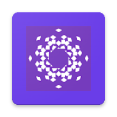
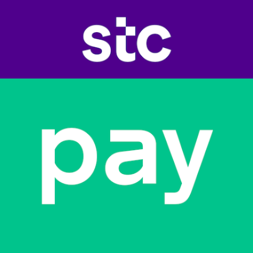

## Hi, I'm Gulraiz Ali 👋

Senior Android Engineer & Lead Mobile Application Developer with **9+ years of experience**
building **secure, scalable, high-performance Android applications** used by **1M+ users**.
I specialize in **fintech, banking, enterprise, and consumer-grade mobile solutions**, working
successfully with **fully remote and distributed teams**.

🌍 **Open to Remote Android Roles**
🕒 **Availability:** Open to full-time remote roles | Contract | Long-term

---

## 🚀 Professional Overview
- 9+ years of professional **Android development experience**
- 5+ years leading **remote teams**, mentoring engineers, and owning end-to-end delivery
- Strong expertise in **Kotlin, Jetpack Compose, and Clean Architecture (MVVM/MVI)**
- Extensive background in **fintech, digital wallets, banking, and secure payments**
- Proven ability to deliver **production-ready apps** in regulated environments

---

## ⭐ Featured Projects

<!-- Kuraimi Jawwal Project --->

  <strong>Kuraimi Jawal Application - Banking Application</strong> 
  Secure Android banking application built for regulated financial environments. 
  <strong>Impact:</strong> 1M+ downloads, serving a large and active banking user base. 
  <strong>Tech:</strong> Kotlin, Jetpack Compose, Retrofit, Room

 

<!-- Stc Pay BH --->

  <strong>STC Pay BH – Mobile Wallet</strong> 
  Feature-rich fintech app for Bahrain with multi-lingual support, card management, transfers, bill payments, and remittance. 
  <strong>Impact:</strong> High-scale wallet used nationwide with secure banking-grade transactions. 
  <strong>Tech:</strong> Kotlin, Jetpack Compose, Coroutines, Hilt, Room, Retrofit, Firebase

 

<!-- Mfloos Customers -->

  <strong>mFloos – Customers</strong> 
  Yemen’s first eWallet app for secure wallet transfers, international remittances, merchant & bill payments, and agent-assisted cash-in/out services. 
  <strong>Impact:</strong> Enables financial inclusion in urban and rural areas with offline & SMS-based transactions. 
  <strong>Tech:</strong> Kotlin, Jetpack Compose, MVVM, Hilt, Room, Retrofit, Biometric Auth, 2FA, SSL Pinning

 

<!-- KIB App -->

  <strong>Kuraimi Islamic Bank (KiB) – Banking App</strong> 
  Multi-currency Islamic banking app with Sharia-compliant products, secure transfers, and dynamic dashboards. 
  <strong>Impact:</strong> Advanced mobile banking platform trusted by users in Yemen. 
  <strong>Tech:</strong> Kotlin, Jetpack Compose, MVI, Hilt, Room, Retrofit, AES/RSA, Biometric Auth

 

<!-- Migraine Relief -->

  <strong>Migraine Relief – Health & Research App</strong> 
  Mobile app for early migraine detection and management, developed in collaboration with MIT & Harvard School of Medicine. Collects physiological, behavioral, and environmental data to predict migraine risk and provide actionable insights. 
  <strong>Impact:</strong> Supports research and patient care, integrating wearables and mobile data to improve migraine management. 
  <strong>Tech:</strong> Kotlin, MVVM, Retrofit, Firebase Firestore & Realtime Database, WorkManager, Kotlin Coroutines, Cross-platform data handling

 

---

## 🧠 Technical Expertise

**Programming Languages**
- Kotlin, Java

**UI & Frameworks**
- Jetpack Compose
- Android SDK
- Material Design

**Architecture & Patterns**
- Clean Architecture
- MVVM, MVI
- Modularization (multi-module setups)

**Networking & Data**
- Retrofit, OkHttp
- Room, SQLite
- Firebase

**Security**
- Android Keystore
- AES / RSA encryption
- TLS & Certificate Pinning
- SecureSharedPreferences
- ProGuard / R8
- NDK-based hardening

**Tooling & Delivery**
- Git & GitHub
- CI/CD (Azure DevOps)
- Gradle, Build Variants
- Unit Testing

---

## 🏦 Domain Experience
- Fintech & Digital Wallets
- Banking & Islamic Banking Apps
- Secure Payments & Transactions
- High-traffic, compliance-driven applications
- Healthtech
- Tourism
- Learning
- Utility

---

## 🧩 What You’ll Find on My GitHub
- 📱 **Production-style Android applications**
- 🏗️ **Clean Architecture & modular app setups**
- 🎨 **Jetpack Compose UI and design systems**
- 🧪 **Testing strategies & maintainable codebases**
- 🔐 **Security, performance, and scalability-focused implementations**

Each repository reflects **real-world engineering decisions**, not toy examples.

---

## 🧑‍💻 How I Work (Remote-First)
- Ownership-driven development from requirements to release
- Clear documentation and structured READMEs
- Architecture-first approach for long-term scalability
- Meaningful commit history & clean Git practices
- Strong async communication with product, backend, and QA teams

---

## 📫 Connect With Me
- 💼 LinkedIn: [linkedin.com/in/gulraizali](https://www.linkedin.com/in/gulraizali/)
- ✉️ Email: gulraizali90@gmail.com
- 📍 Location: Lahore, Pakistan (Remote)
- 📱 WhatsApp: [+92 304 1415045](https://wa.me/923041415045)
